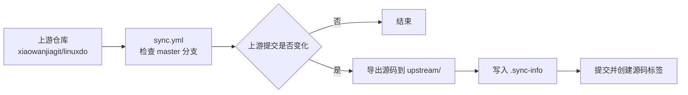

<div align="center">

# Linux.Do-JS

Linux.do 自动浏览助手的源码镜像

[](https://github.com/xiaowanjiagit/linuxdo)
[](https://github.com/xiaowanjiagit/linuxdo/tree/master)
[](https://github.com/hopol/Linux.Do-JS/actions/workflows/sync.yml)
[](LICENSE)
[](https://github.com/xiaowanjiagit/linuxdo/blob/master/LICENSE)

[上游仓库](https://github.com/xiaowanjiagit/linuxdo) · [Actions](https://github.com/hopol/Linux.Do-JS/actions)

</div>

---

## 📌 说明

本仓库用于镜像 [`xiaowanjiagit/linuxdo`](https://github.com/xiaowanjiagit/linuxdo) 的源码。

- 源码来自上游 `master` 分支，导出到 `upstream/`。
- 本仓库不修改上游源码，也不提供上游项目的官方支持。

> [!NOTE]
> 上游项目是面向 Linux.do 的 Tampermonkey 用户脚本，包含自动浏览、滚动、浏览记录和随机点赞等功能。功能说明、使用方法和更新内容请以上游仓库为准。

## 📁 镜像范围

| 内容 | 位置 | 说明 |
|---|---|---|
| 上游源码 | `upstream/` | 通过 `git archive` 从上游 `master` 分支导出。 |
| 同步信息 | `upstream/.sync-info` | 记录上游提交、同步时间、分支和版本号。 |
| 源码标签 | `mirror-source-v{版本}-{短提交}` | 对应一次源码同步。 |

## 🔄 自动同步

本仓库包含两个 GitHub Actions 工作流：



| 工作流 | 文件 | 默认时间（UTC） | 用途 |
|---|---|---:|---|
| 同步源码 | `.github/workflows/sync.yml` | 02:00 | 检查上游 `master` 分支，发现新提交后更新 `upstream/`。 |

该工作流也支持在 Actions 页面手动运行。

> [!IMPORTANT]
> GitHub Actions 中的定时任务使用 UTC 时间。当前 cron 表达式的日期字段为 `*/5`，实际运行日期通常是每月 1、6、11、16、21、26、31 日，不等同于严格每 5 天运行一次。

## 🧾 同步信息

每次源码同步后，`upstream/.sync-info` 会写入类似内容：

```ini
commit=0123456789abcdef...
timestamp=2026-08-07T00:00:00Z
upstream_url=https://github.com/xiaowanjiagit/linuxdo
upstream_branch=master
version=2.0.0
```

| 字段 | 含义 |
|---|---|
| `commit` | 上游 `master` 分支的提交哈希。 |
| `timestamp` | 同步时间，UTC。 |
| `upstream_url` | 上游仓库地址。 |
| `upstream_branch` | 同步分支。 |
| `version` | 从 `src/linuxdo-automation.user.js` 的用户脚本元数据中读取的 `@version`。 |

同步脚本会先读取已提交的 `.sync-info`，再判断上游提交是否变化。只有提交不同才会更新 `upstream/` 并创建新的提交和标签。

## 💻 本地同步源码

`sync.sh` 可用于本地手动同步源码。

### 要求

- Git；
- Bash 环境，例如 Linux、macOS、WSL 或 Git Bash；
- 能访问 GitHub；
- 如需推送结果，需要对本仓库有写入权限。

### 使用方式

```bash
git clone https://github.com/hopol/Linux.Do-JS.git
cd Linux.Do-JS
chmod +x sync.sh
./sync.sh
```

脚本会执行以下操作：

1. 确认或添加 `upstream` 远程；
2. 拉取上游 `master` 分支和标签；
3. 对比上次记录的上游提交；
4. 如有变化，重新导出 `upstream/`；
5. 写入 `.sync-info`，提交变更，创建并推送源码镜像标签。

### 同步配置

```bash
UPSTREAM_URL="https://github.com/xiaowanjiagit/linuxdo.git"
UPSTREAM_WEB_URL="https://github.com/xiaowanjiagit/linuxdo"
UPSTREAM_BRANCH="master"
MIRROR_REPO="https://github.com/hopol/Linux.Do-JS"
```

如果修改同步来源或分支，请同时检查 GitHub Actions 工作流中的对应变量。

## 🛠️ 维护常用命令

```bash
# 查看远程仓库
git remote -v

# 查看当前镜像对应的上游提交
git show HEAD:upstream/.sync-info

# 列出镜像标签
git tag -l 'mirror-*'

# 手动拉取上游 master 分支
git fetch upstream master --tags
```

## ❓ 常见问题

| 问题 | 处理方式 |
|---|---|
| Actions 无法推送提交或标签 | 检查仓库 Settings → Actions → General 中的 Workflow permissions，确保 `GITHUB_TOKEN` 有写入权限。 |
| 定时任务没有准时运行 | GitHub scheduled workflow 可能延迟，且时间按 UTC 计算。 |
| 获取不到上游分支 | 确认上游仍然存在 `master` 分支，并检查网络访问。 |
| 源码同步每次都产生提交 | 检查 `upstream/.sync-info` 是否已提交，以及工作流是否在删除 `upstream/` 前读取旧记录。 |

## ⚖️ 许可证与使用说明

| 内容 | 许可证 |
|---|---|
| 本仓库编写的脚本、工作流和文档 | [MIT License](LICENSE) |
| `upstream/` 中镜像的 Linux.do 用户脚本及其他源码 | 上游 [MIT License](https://github.com/xiaowanjiagit/linuxdo/blob/master/LICENSE) |

> [!CAUTION]
> 上游脚本可自动执行浏览、滚动和点赞等操作。请遵守 Linux.do 的服务条款和社区规则，使用保守配置，避免高频或无人值守操作。因使用脚本造成的账号、服务或其他后果，由使用者自行承担。

---

<div align="center">

本仓库只是镜像，不是上游项目官方仓库。

[返回顶部](#linuxdo-js)

</div>
